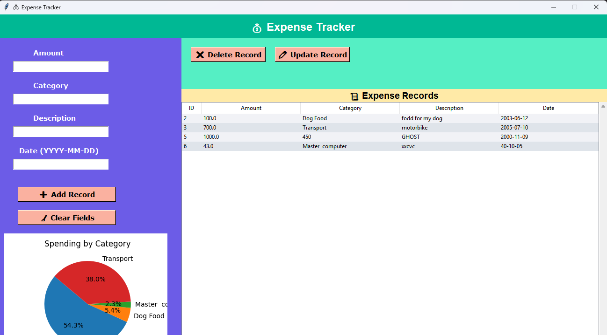

# 💰 Expense Tracker (Tkinter + SQLite + Matplotlib)

A simple **Expense Tracker Desktop Application** built with **Python, Tkinter, SQLite3, and Matplotlib**.  
This project is designed for beginners to learn **GUI programming**, **database handling**, and **data visualization** in Python.  

You can **add, update, delete, and view expenses**, along with a **pie chart** showing spending by category.  
The repository also includes a **sample `expenses.db` database** so you can experiment right away.  

---

## 🚀 Features

- ✅ Add new expense records  
- ✅ Update existing records  
- ✅ Delete records easily  
- ✅ View expenses in a table (Treeview)  
- ✅ Pie chart visualization of spending by category  
- ✅ User-friendly interface with hover effects  

---

## 🛠️ Tech Stack

- **Python 3.x**  
- **Tkinter** → GUI framework  
- **SQLite3** → Database for storing expenses  
- **Matplotlib** → Pie chart visualization  

---

## 📂 Project Structure

```
📦 Expense-Tracker
 ┣ 📜 expenses.db       # Preloaded SQLite database (for learners)
 ┣ 📜 expense_tracker.py  # Main application code
 ┣ 📜 README.md          # Project guide (this file)
```

---

## ▶️ How to Run

1. **Clone the repository**

   ```bash
   git clone https://github.com/your-username/expense-tracker.git
   cd expense-tracker
   ```

2. **Install required libraries**

   ```bash
   pip install matplotlib
   ```

   *(Tkinter & SQLite3 come pre-installed with Python)*

3. **Run the app**

   ```bash
   python expense_tracker.py
   ```

---

## 📊 Sample Database

A sample **`expenses.db`** is included with a few records so you can instantly see how things work.  
You can delete it anytime — the app will create a new database automatically.  

---

## 📸 Screenshots



---

## 🎥 YouTube Tutorial

👉 Watch the full tutorial here: [https://youtube.com/@ag_youtube?si=85gRFD9z8CAm4qNk](https://youtube.com/@ag_youtube?si=85gRFD9z8CAm4qNk)

---

## 🤝 Contributing

Feel free to fork this repo and play around with:

- Adding search/filter options  
- Exporting data to CSV/Excel  
- Adding monthly/weekly summaries  

---

## 📜 License

This project is **free to use** for learning purposes.


